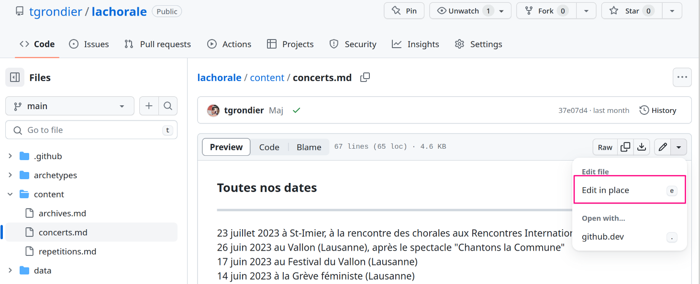

# La Chorale

Ce repositoire contient le code source pour une proposition d'une nouvelle version du site web de la Chorale Anarchiste de Lausanne.  
Le site actuel est deploye a l'adresse <https://lachorale.ch>. Il s'agit une d'application PHP dont le code source
n'est pas disponible.

Il est possible de previsualiser le site généré par ce code source a l'adresse <https://lachorale.tschuss.li>.

Le code source du site ainsi que son contenu est mis a disposition libre et non marchande. Il n'y a explicitement pas de copyright ou de license: `ni dieu, ni maître, ni ©`.

## Motivation

*Cette partie du README est destinee a expliquer le comment et le pourquoi a un public non-technique. Elle explique les choix d'outils et de plateformes pour l'etat actuel du projet*

Un des buts de ce projet d'avoir un [facteur d'autobus](https://fr.wikipedia.org/wiki/Facteur_d'autobus) aussi eleve que possible. La proposition actuelle permet d'assurer que n'importe qui puisse heberger sa propre copie du site en cas de probleme; le seul point de defaillance serait le controle du domaine `lachorale.ch` (qui en est deja, et qui en sera toujours un).

### Git

[Git](https://fr.wikipedia.org/wiki/Git) est un logiciel de gestion de version decentralise. Il permet de conserver dans ce qu'on appelle un `depot` l'historique de modification des fichiers, et de collaborer de maniere asynchrone sur des projets. Pour les fichiers texte, git permet meme de les modifier de maniere asynchrone (*NB: asynchrone ne veut pas dire simultane, ce n'est pas un framapad!*).

Toute personne possedant une copie de ce depot a acces a tout l'historique du projet. Cela permet d'assurer la survie du code de maniere redondante en cas de catastrophe (par exemple, exclusion de la plateforme actuelle).

Le depots git peuvent exister de maniere hors-ligne, mais pour faciliter la collaboration, ils sont generalement accessible via internet (avec droits d'ecriture soumis a authentification). Plusieurs facons existent de rendre les repositoires accessibles, que ce soit en les hebergeant soit-meme ou via des plateformes telles que [GitLab](https://about.gitlab.com/) ou [Github](https://about.gitlab.com/)

#### Github

Github est une platforme qui offre l'hebergement de depots Git, gratuitement pour les projets open-source. L'auteure admet ici que la plateforme elle même est basee aux Etats-Unis et a participe par ses actions a [l'hegemonie et imperialisme americain](https://en.wikipedia.org/wiki/GitHub#Controversies).  
Les autres alternatives:

* faire de l'hebergement chez un particulier. Cela demande du materiel et des connaissances specifiques et particulieres alors que l'on cherche a eliminer ces besoins.
* faire de l'hebergement chez fournisseur d'infrastructure virtuelle. Memes problemes que la solution d'au dessus, et la quasi totalite de ces fournisseurs souffre des memes problemes que Github
* utiliser d'autres plateformes telles que GitLab. A nouveau, ces plateformes ont les memes problemes que Github.

Le systeme actuel n'offre pas de solution neutre. Github a l'avantage d'etre la platforme de choix pour les projets open source modernes et d'offrir des outils collaboratifs adaptes aux utilisateurs non techniques.

### Hugo

[Hugo](https://github.com/gohugoio/hugo) est un generateur de site web statiques. Il est leger et permet de decoupler facilement le contenu du site de sa forme. Un site web statique est un site web qui mit a disposition sous forme de fichiers qui ne changent pas. Contrairement a l'application PHP actuelle qui regenere la page pour chaque requete, ici elle n'est generee qu'une seule fois a chaque mise a jour.  
Hugo a l'avante d'avoir un tres large exosysteme d'hebergeurs gratuits, qui generent le site directement depuis le code source Git.

### lachorale.tschuss.li

Actuellement, le site internet <https://lachorale.tschuss.li> est genere via <https://render.com>. Ce choix a ete fait a cause de la video La Vie S'Ecoule qui est beaucoup trop grande pour la plupart des hebergeurs. La plateforme regenere le site a chaque mise a jour du depot Git

### Mettre a jour le site

#### Fichiers

Il suffit de les placer dans les dossiers correspondants:

| Type         | Emplacement                                |
|--------------|--------------------------------------------|
| partitions   | [static/partitions](./static/partitions)   |
| flyers       | [static/flyers](./static/flyers)           |
| sons         | [static/sons](./static/sons)               |
| chansonniers | [static/chansonnier](./static/chansonnier) |

#### Dates des concerts

Utiliser l'editeur web pour mettre a jour le fichier [concerts.md](content/concerts.md).

Il est possible avec l'editeur de previsualiser ses changements.

#### Dates des repetitions

Utiliser l'editeur web pour mettre a jour le fichier [repetitions.md](content/repetitions.md)

#### Texte d'introduction

Le texte d'introduction est modifiable depuis le fichier [hugo.toml](hugo.toml)

## Development

* Installer `Hugo`
* Cloner ce depot
* Lancer `hugo server` depuis la ligne de commande
